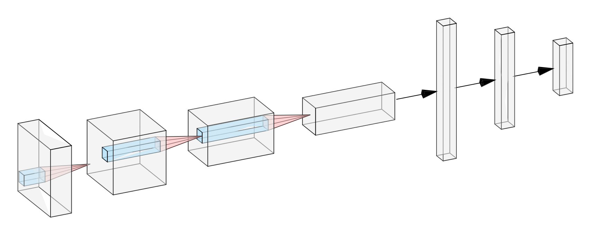

# Architecture

Detailed information about the Chess CV model architectures, training strategies, and performance characteristics for the pieces, arrows, and snap models.

<figure markdown>
  
  <figcaption>CNN architecture for chess piece classification</figcaption>
</figure>

## Pieces Model

### Model Architecture

Chess CV uses a lightweight Convolutional Neural Network (CNN) designed for efficient inference while maintaining high accuracy on 32×32 pixel chess square images.

#### Network Design

```
Input: 32×32×3 RGB image

Conv Layer 1:
├── Conv2d(3 → 16 channels, 3×3 kernel)
├── ReLU activation
└── MaxPool2d(2×2) → 16×16×16

Conv Layer 2:
├── Conv2d(16 → 32 channels, 3×3 kernel)
├── ReLU activation
└── MaxPool2d(2×2) → 8×8×32

Conv Layer 3:
├── Conv2d(32 → 64 channels, 3×3 kernel)
├── ReLU activation
└── MaxPool2d(2×2) → 4×4×64

Flatten → 1024 features

Fully Connected 1:
├── Linear(1024 → 128)
├── ReLU activation
└── Dropout(0.5)

Fully Connected 2:
└── Linear(128 → 13) → Output logits

Softmax → 13-class probabilities
```

#### Model Statistics

- **Total Parameters**: 156,077
- **Trainable Parameters**: 156,077
- **Model Size**: ~600 KB (safetensors format)
- **Input Size**: 32×32×3 (RGB)
- **Output Classes**: 13

#### Class Labels

The model classifies chess squares into 13 categories:

**Black Pieces (6):**

- `bB` – Black Bishop
- `bK` – Black King
- `bN` – Black Knight
- `bP` – Black Pawn
- `bQ` – Black Queen
- `bR` – Black Rook

**White Pieces (6):**

- `wB` – White Bishop
- `wK` – White King
- `wN` – White Knight
- `wP` – White Pawn
- `wQ` – White Queen
- `wR` – White Rook

**Empty (1):**

- `xx` – Empty square

### Performance Characteristics

#### Expected Results

With the default configuration:

- **Test Accuracy**: ~99.90%
- **F1 Score (Macro)**: ~99.90%
- **Training Time**: ~90 minutes (varies by hardware)
- **Inference Speed**: 0.05 ms per image (batch size 8192, varying by hardware)

#### Per-Class Performance

Actual accuracy by piece type (Test Dataset):

| Class | Accuracy | Class | Accuracy |
| ----- | -------- | ----- | -------- |
| bB    | 99.90%   | wB    | 99.90%   |
| bK    | 100.00%  | wK    | 99.90%   |
| bN    | 100.00%  | wN    | 99.90%   |
| bP    | 99.81%   | wP    | 99.81%   |
| bQ    | 99.90%   | wQ    | 99.81%   |
| bR    | 100.00%  | wR    | 99.81%   |
| xx    | 100.00%  |       |          |

#### Evaluation on External Datasets

The model has been evaluated on external datasets to assess generalization:

##### OpenBoard

- **Dataset**: [S1M0N38/chess-cv-openboard](https://huggingface.co/datasets/S1M0N38/chess-cv-openboard)
- **Number of samples**: 6,016
- **Overall Accuracy**: 99.30%
- **F1 Score (Macro)**: 98.56%

Per-class performance on OpenBoard:

| Class | Accuracy | Class | Accuracy |
| ----- | -------- | ----- | -------- |
| bB    | 99.11%   | wB    | 100.00%  |
| bK    | 100.00%  | wK    | 100.00%  |
| bN    | 100.00%  | wN    | 98.97%   |
| bP    | 99.81%   | wP    | 99.61%   |
| bQ    | 97.10%   | wQ    | 98.48%   |
| bR    | 99.32%   | wR    | 98.03%   |
| xx    | 99.24%   |       |          |

##### ChessVision

- **Dataset**: [S1M0N38/chess-cv-chessvision](https://huggingface.co/datasets/S1M0N38/chess-cv-chessvision)
- **Number of samples**: 3,186
- **Overall Accuracy**: 93.13%
- **F1 Score (Macro)**: 92.28%

Per-class performance on ChessVision:

| Class | Accuracy | Class | Accuracy |
| ----- | -------- | ----- | -------- |
| bB    | 100.00%  | wB    | 95.87%   |
| bK    | 92.62%   | wK    | 99.09%   |
| bN    | 100.00%  | wN    | 99.09%   |
| bP    | 90.92%   | wP    | 92.26%   |
| bQ    | 98.92%   | wQ    | 85.06%   |
| bR    | 98.92%   | wR    | 96.69%   |
| xx    | 89.17%   |       |          |

!!! note "Multi-Split Dataset"

    The ChessVision dataset contains multiple splits. All splits are concatenated during evaluation to produce a single comprehensive score.

!!! note "Out of Sample Performance"

    The lower performance on OpenBoard (99.30% accuracy, 98.56% F1) and ChessVision (93.13% accuracy, 92.28% F1) compared to the test set (99.90% accuracy, 99.90% F1) indicates some domain gap between the synthetic training data and these external datasets. ChessVision shows significantly lower performance, particularly on specific piece types like white queens (85.06%) and empty squares (89.17%).

### Dataset Characteristics

#### Synthetic Data Generation

The training data is synthetically generated:

**Source Materials:**

- 55 board styles (256×256px)
- 64 piece sets (32×32px)
- Multiple visual styles from chess.com and lichess

**Generation Process:**

1. Render each piece onto each board style
2. Extract 32×32 squares at piece locations
3. Extract empty squares from light and dark squares
4. Split combinations across train/val/test sets

**Data Statistics:**

- **Total Combinations**: ~3,520 (55 boards × 64 piece sets)
- **Images per Combination**: 26 (12 pieces × 2 colors + 2 empty)
- **Total Images**: ~91,500
- **Train Set**: ~64,000 (70%)
- **Validation Set**: ~13,500 (15%)
- **Test Set**: ~13,500 (15%)

#### Class Balance

The dataset is perfectly balanced:

- Each class has equal representation
- Each board-piece combination contributes equally
- Train/val/test splits maintain class balance

---

## Arrows Model

### Model Architecture

#### Overview

The arrows model uses the same SimpleCNN architecture as the pieces model, but is trained to classify arrow overlay components instead of chess pieces. This enables detection and reconstruction of arrow annotations commonly used in chess analysis interfaces.

#### Network Design

The network architecture is identical to the pieces model (see [Pieces Model Architecture](#network-design) above), with the only difference being the output layer dimension.

```
[Same architecture as pieces model]

Fully Connected 2:
└── Linear(128 → 49) → Output logits

Softmax → 49-class probabilities
```

#### Model Statistics

- **Total Parameters**: 156,077 (same as pieces model)
- **Trainable Parameters**: 156,077
- **Model Size**: ~645 KB (safetensors format)
- **Input Size**: 32×32×3 (RGB)
- **Output Classes**: 49

#### Class Labels

The model classifies chess squares into 49 categories representing arrow components:

**Arrow Heads (20):**

Directional arrow tips in 8 cardinal/ordinal directions plus intermediate angles:

- `head-N`, `head-NNE`, `head-NE`, `head-ENE`, `head-E`, `head-ESE`, `head-SE`, `head-SSE`
- `head-S`, `head-SSW`, `head-SW`, `head-WSW`, `head-W`, `head-WNW`, `head-NW`, `head-NNW`

**Arrow Tails (12):**

Directional arrow tails in 8 cardinal/ordinal directions plus intermediate angles:

- `tail-N`, `tail-NNE`, `tail-NE`, `tail-ENE`, `tail-E`, `tail-ESE`, `tail-SE`, `tail-SSE`
- `tail-S`, `tail-SSW`, `tail-SW`, `tail-W`

**Middle Segments (8):**

Arrow shaft segments for straight and diagonal lines:

- `middle-N-S`, `middle-E-W`, `middle-NE-SW`, `middle-SE-NW`
- `middle-N-ENE`, `middle-E-SSE`, `middle-S-WSW`, `middle-W-NNW`
- `middle-N-WNW`, `middle-E-NNE`, `middle-S-ESE`, `middle-W-SSW`

**Corners (4):**

Corner pieces for knight-move arrows (L-shaped patterns):

- `corner-N-E`, `corner-E-S`, `corner-S-W`, `corner-W-N`

**Empty (1):**

- `xx` – Empty square (no arrow)

**Naming Convention:** NSEW refers to compass directions (North/South/East/West), indicating arrow orientation on the board from white's perspective.

### Performance Characteristics

#### Expected Results

With the default configuration:

- **Test Accuracy**: ~99.99%
- **F1 Score (Macro)**: ~99.99%
- **Training Time**: ~9 minutes for 20 epochs (varies by hardware)
- **Inference Speed**: ~0.019 ms per image (batch size 512, varies by hardware)

#### Per-Class Performance

The arrows model achieves near-perfect accuracy across all 49 classes on the synthetic test dataset:

**Summary Statistics:**

- **Highest Accuracy**: 100.00% (26 classes)
- **Lowest Accuracy**: 99.27% (tail-S)
- **Mean Accuracy**: 99.97%
- **Classes > 99.9%**: 40 out of 49

**Performance by Component Type:**

| Component Type  | Classes | Avg Accuracy | Range         |
| --------------- | ------- | ------------ | ------------- |
| Arrow Heads     | 20      | 99.97%       | 99.56% - 100% |
| Arrow Tails     | 12      | 99.89%       | 99.27% - 100% |
| Middle Segments | 8       | 99.96%       | 99.78% - 100% |
| Corners         | 4       | 99.98%       | 99.93% - 100% |
| Empty Square    | 1       | 99.93%       | -             |

!!! note "No External Dataset Evaluation"

    Unlike the pieces model, the arrows model has only been evaluated on synthetic test data. No external datasets with annotated arrow components are currently available for out-of-distribution testing.

#### Training Configuration

The arrows model uses different hyperparameters than the pieces model, optimized for the 49-class arrow classification task:

- **Epochs**: 20 (vs 200 for pieces - converges much faster)
- **Batch Size**: 128 (vs 64 for pieces - larger batches for more stable training)
- **Learning Rate**: 0.0005 (vs 0.0003 for pieces)
- **Weight Decay**: 0.00005 (vs 0.0003 for pieces - less regularization needed)
- **Optimizer**: AdamW
- **Early Stopping**: Disabled

### Dataset Characteristics

#### Synthetic Data Generation

The arrows training data is synthetically generated using the same board styles as the pieces model:

**Source Materials:**

- 55 board styles (256×256px)
- Arrow overlay images organized by component type
- Multiple visual styles from chess.com and lichess

**Generation Process:**

1. Render arrow components onto board backgrounds
2. Extract 32×32 squares at arrow locations
3. Extract empty squares from light and dark squares
4. Split combinations across train/val/test sets

**Data Statistics:**

- **Total Images**: ~4.5 million
- **Train Set**: ~3,139,633 (70%)
- **Validation Set**: ~672,253 (15%)
- **Test Set**: ~672,594 (15%)

The significantly larger dataset compared to pieces (~4.5M vs ~91K) is due to the combination of 55 boards × 49 arrow component types, with multiple arrow variants per component type.

#### Class Balance

The dataset maintains balanced class distribution:

- Each arrow component class has equal representation
- Each board-arrow combination contributes equally
- Train/val/test splits maintain class balance

#### Limitations

!!! warning "Single Arrow Component Per Square"

    The model is trained on images containing **at most one arrow component per square**. Classification accuracy degrades significantly when multiple arrow parts overlap in a single square, which can occur with densely annotated boards or crossing arrows.

    **Example failure case**: If a square contains both an arrow head and a perpendicular arrow shaft, the model may only detect one component or produce incorrect predictions.

---

## Snap Model

### Model Architecture

#### Overview

The snap model uses the same SimpleCNN architecture as the pieces and arrows models, but is trained to classify piece centering quality instead of piece identity or arrow components. This enables automated detection of whether chess pieces are properly positioned within board squares, facilitating quality control for digital chess interfaces and automated analysis systems.

#### Network Design

The network architecture is identical to the pieces model (see [Pieces Model Architecture](#network-design) above), with the only difference being the output layer dimension.

```
[Same architecture as pieces model]

Fully Connected 2:
└── Linear(128 → 2) → Output logits

Softmax → 2-class probabilities
```

#### Model Statistics

- **Total Parameters**: 156,077 (same as pieces model)
- **Trainable Parameters**: 156,077
- **Model Size**: ~600 KB (safetensors format)
- **Input Size**: 32×32×3 (RGB)
- **Output Classes**: 2

#### Class Labels

The model classifies chess squares into 2 categories representing piece centering quality:

**Centered (1):**

- `ok` – Pieces that are properly centered or slightly off-centered, plus empty squares

**Off-Centered (1):**

- `bad` – Pieces that are significantly misaligned or positioned poorly within the square

**Rationale:** The model treats both properly centered pieces and empty squares as "ok" since both represent valid board states. Only poorly positioned pieces trigger the "bad" classification, enabling automated quality assurance.

### Performance Characteristics

#### Expected Results

With the default configuration:

- **Test Accuracy**: ~99.93%
- **F1 Score (Macro)**: ~99.93%
- **Training Time**: TBD (training in progress, 200 epochs)
- **Inference Speed**: ~0.05 ms per image (similar to pieces model, varying by hardware)

#### Per-Class Performance

The snap model achieves excellent accuracy across both classes on the synthetic test dataset:

**Summary Statistics:**

- **Highest Accuracy**: 99.98% (ok)
- **Lowest Accuracy**: 99.88% (bad)
- **Mean Accuracy**: 99.93%
- **Classes > 99.9%**: 1 out of 2

#### Evaluation on External Datasets

*No external dataset evaluation has been conducted yet. The model has only been evaluated on synthetic test data.*

#### Training Configuration

The snap model uses similar hyperparameters to the pieces model, optimized for the 2-class centering classification task:

- **Epochs**: 200 (same as pieces model)
- **Batch Size**: 64 (same as pieces model)
- **Learning Rate**: 0.001 with warmup and cosine decay (same as pieces model)
- **Weight Decay**: 0.001 (same as pieces model)
- **Optimizer**: AdamW
- **Early Stopping**: Disabled

### Dataset Characteristics

#### Synthetic Data Generation

The snap training data is synthetically generated using the same board styles as the pieces model:

**Source Materials:**

- 55 board styles (256×256px)
- 64 piece sets (32×32px)
- Multiple visual styles from chess.com and lichess
- Centered and off-centered piece positions

**Generation Process:**

1. Render pieces with intentional positioning variations
2. Extract 32×32 squares at piece locations
3. Extract empty squares from light and dark squares
4. Split combinations across train/val/test sets

**Data Statistics:**

- **Total Images**: ~1.4M synthetic images
- **Train Set**: ~980,000 (70%)
- **Validation Set**: ~210,000 (15%)
- **Test Set**: ~210,000 (15%)

The dataset is generated with 8 positional variations per piece-board combination:

- Non-empty pieces: 4 "ok" (centered/slightly off-centered) + 4 "bad" (significantly off-centered) variations
- Empty squares: 4 "ok" variations only (empty squares are always considered valid)
- This comprehensive variation strategy ensures robust centering detection across different board styles, piece sets, and positioning variations

#### Class Balance

The dataset maintains balanced class distribution:

- Each centering class has equal representation
- Empty squares are included in the "ok" class
- Train/val/test splits maintain class balance

#### Limitations

!!! warning "Centering Semantics Preservation"

    The model is trained with **conservative augmentation** to preserve centering semantics. No rotation or significant geometric transformations are applied that could alter the perceived centering of pieces within squares.

!!! warning "Synthetic Training Data"

    The model is trained only on synthetically generated centering variations. Performance on real-world chess board images with natural positioning variations may vary from synthetic test results.
