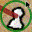
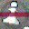

# Data Augmentation

Documentation of data augmentation used in training.

## Configuration

Augmentation parameters are defined in `src/chess_cv/constants.py`:

```python
AUGMENTATION_CONFIGS = {
    "pieces": {
        "padding": 16,
        "padding_mode": "edge",
        "rotation_degrees": 10,
        "center_crop_size": 40,
        "final_size": 32,
        "resized_crop_scale": (0.54, 0.74),
        "resized_crop_ratio": (0.9, 1.1),
        "arrow_probability": 0.80,
        "highlight_probability": 0.25,
        "mouse_probability": 0.90,
        "horizontal_flip": True,
        "horizontal_flip_prob": 0.5,
        "brightness": 0.15,
        "contrast": 0.2,
        "saturation": 0.2,
        "hue": 0.2,
        "noise_mean": 0.0,
        "noise_sigma": 0.05,
    },
    "arrows": {
        "arrow_probability": 0.0,
        "highlight_probability": 0.25,
        "scale_min": 0.75,
        "scale_max": 1.0,
        "horizontal_flip": False,
        "brightness": 0.20,
        "contrast": 0.20,
        "saturation": 0.20,
        "hue": 0.2,
        "rotation_degrees": 2,
        "noise_mean": 0.0,
        "noise_sigma": 0.10,
    },
}
```

---

## Pieces Model Pipeline

<div align="center" markdown="1">

{ width="75" style="margin: 0 10px;" }
{ width="75" style="margin: 0 10px;" }
{ width="75" style="margin: 0 10px;" }
{ width="75" style="margin: 0 10px;" }

{ width="75" style="margin: 0 10px;" }
{ width="75" style="margin: 0 10px;" }
{ width="75" style="margin: 0 10px;" }
{ width="75" style="margin: 0 10px;" }

*The first row shows original training images, while the second row displays their augmented versions for the pieces model.*

</div>

Applied in order during training:

1. **Expand Canvas** (16px padding): Pads image by 16px on all sides using edge replication mode (32×32 → 64×64). Creates space for rotation without cropping piece edges.

2. **Random Rotation** (±10°): Rotates image with black fill. More aggressive than previous ±5° to improve robustness.

3. **Center Crop** (40×40): Removes black corners introduced by rotation using conservative formula: `64 - (ceil(tan(10°) × 64) × 2) = 40`. Ensures no rotation artifacts remain.

4. **Random Resized Crop** (area scale 0.54-0.74, aspect ratio 0.9-1.1, output 32×32): Crops random region then resizes to 32×32. Base area ratio (32/40)² = 0.64 provides translation without zoom. Range 0.54-0.74 adds ±16% zoom variation. Aspect ratio 0.9-1.1 allows ±10% stretch for additional robustness.

5. **Arrow Overlay** (80% probability): Overlays random arrow component from `data/arrows/`. Applied after geometric transforms to maintain crisp arrow graphics.

6. **Highlight Overlay** (25% probability): Overlays semi-transparent highlight from `data/highlights/`.

7. **Mouse Overlay** (90% probability): Overlays random mouse cursor from `data/mouse/` with geometric transformations. Applies padding (134px), small rotation (±5°), center crop (246×246), random resized crop to final size (32×32) with scale 0.20-0.30 and ratio 0.8-1.2, making cursor smaller and positioning it randomly on the piece.

8. **Horizontal Flip** (50% probability): Flips image left-to-right.

9. **Color Jitter**: Randomly adjusts brightness (±15%), contrast (±20%), saturation (±20%), and hue (±20%).

10. **Gaussian Noise** (σ=0.05): Adds noise to normalized [0,1] pixels.

---

## Arrows Model Pipeline

<div align="center" markdown="1">

{ width="75" style="margin: 0 10px;" }
{ width="75" style="margin: 0 10px;" }
{ width="75" style="margin: 0 10px;" }
{ width="75" style="margin: 0 10px;" }

{ width="75" style="margin: 0 10px;" }
{ width="75" style="margin: 0 10px;" }
{ width="75" style="margin: 0 10px;" }
{ width="75" style="margin: 0 10px;" }

*The first row shows original training images, while the second row displays their augmented versions for the arrows model.*

</div>

Applied in order during training:

1. **Highlight Overlay** (25% probability): Overlays semi-transparent highlight from `data/highlights/`. Applied early before other transforms.

2. **Color Jitter**: Randomly adjusts brightness, contrast, saturation by ±20%, and hue by ±20%.

3. **Random Rotation** (±2°): Small rotation to preserve arrow directionality.

4. **Gaussian Noise** (σ=0.10): Adds noise to normalized [0,1] pixels. Higher noise than pieces model.

---

## Key Differences

| Augmentation        | Pieces                        | Arrows      | Reason                                        |
| ------------------- | ----------------------------- | ----------- | --------------------------------------------- |
| Canvas Expansion    | 16px edge padding (32→64)     | ❌          | Creates rotation space without edge cropping  |
| Rotation            | ±10°                          | ±2°         | Pieces can handle more, arrows need direction |
| Center Crop         | 40×40 (removes black corners) | ❌          | Removes rotation artifacts                    |
| Random Resized Crop | Area 0.54-0.74, ratio 0.9-1.1 | ❌          | Translation + ±16% zoom + ±10% stretch        |
| Arrow Overlay       | 80%                           | ❌          | Pieces must handle arrows                     |
| Highlight Overlay   | 25%                           | 25%         | Both models handle highlights                 |
| Mouse Overlay       | 90%                           | ❌          | Pieces must handle mouse cursors on screen    |
| Horizontal Flip     | 50%                           | ❌          | Arrow direction is semantically important     |
| Color Jitter        | B±15%, CSH±20%                | ±20% (BCSH) | Pieces use reduced brightness variation       |
| Gaussian Noise      | σ=0.05                        | σ=0.10      | Arrows use higher noise                       |

## Implementation

The training script (`src/chess_cv/train.py`) constructs the pipeline dynamically based on model type:

**Pieces Model:**

```python
# 1. Expand canvas (32×32 → 64×64)
v2.Pad(padding=16, padding_mode="edge")

# 2. Rotate with black fill
v2.RandomRotation(degrees=10, fill=0)

# 3. Remove black rotation artifacts (64×64 → 40×40)
# Formula: 64 - (ceil(tan(10°) × 64) × 2) = 40
v2.CenterCrop(size=40)

# 4. Random crop + zoom + resize (40×40 → 32×32)
# Area scale: (32/40)² ± 0.1 = 0.64 ± 0.1 → (0.54, 0.74)
# Aspect ratio: ±10% stretch → (0.9, 1.1)
v2.RandomResizedCrop(size=32, scale=(0.54, 0.74), ratio=(0.9, 1.1))

# 5-7. Overlays
RandomArrowOverlay(probability=0.80)
RandomHighlightOverlay(probability=0.25)
RandomMouseOverlay(probability=0.90)

# 8-9. Geometric + color
v2.RandomHorizontalFlip(p=0.5)
v2.ColorJitter(brightness=0.15, contrast=0.2, saturation=0.2, hue=0.2)

# 10. Noise (requires tensor conversion)
v2.ToImage() → v2.ToDtype() → v2.GaussianNoise() → v2.ToPILImage()
```

**Arrows Model:**

```python
# 1. Highlight overlay
RandomHighlightOverlay(probability=0.25)

# 2-3. Color + rotation
v2.ColorJitter(brightness=0.2, contrast=0.2, saturation=0.2, hue=0.2)
v2.RandomRotation(degrees=2)

# 4. Noise (requires tensor conversion)
v2.ToImage() → v2.ToDtype() → v2.GaussianNoise() → v2.ToPILImage()
```

Validation uses only `v2.Resize((32, 32))` with no augmentation.
